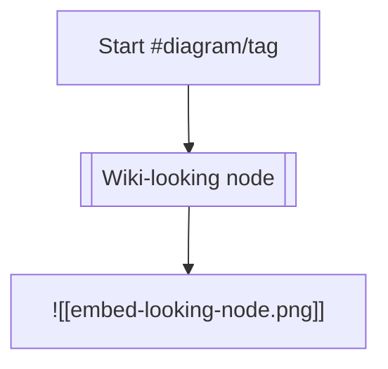

# Complex Nested Markdown Reference

This fixture intentionally mixes valid markdown, Obsidian syntax, raw HTML, malformed
markdown, nested tags, embeds, callouts, tables, footnotes, block IDs, and code fences.
It is modeled after `tag-regex-reference.md`, but pushes more nested combinations.

## Inline Formatting And Tags

Paragraph with **bold and _italic and ==highlight with `inline code` inside==_** plus
~~strike with #status/in-progress nested beside [[Project Hub#Deep Heading|hub link]]~~.

Tags in sequence: #alpha #alpha/beta #alpha/beta/gamma #alpha-beta/gamma_delta
#emoji-ish/smile-test #todo #todo/deep/item #todos-should-not-collapse.

Escaped and adjacent tags: text#not-a-tag, `#code/not-tag`, \#escaped/tag,
(#wrapped/tag), [#linked/tag](https://example.com/tagged), and #final/tag.

## Headings With Raw Html And Strange Markers

# <b>HTML-looking Heading</b>

## <span style="color:red">Styled Heading Text</span>

### Heading With [[Nested Link#Inside Heading|linked alias]]

#### Heading With #heading/tag and ![[Heading Embed.png]]

##### Heading With `inline code` and ==highlight==

###### Deep Legal Heading

####### Seven Hashes Should Stay Paragraph Text

## Lists, Tasks, And Nested Tags

- Top item #list/top
  - Nested item with [[Nested/Path/Note#Anchor|alias]] #list/top/child
    - Deep item with ![[Nested Image.png|320x180]] #list/top/child/embed
      - Deeper item with [external link](https://example.com/deep?x=1#hash)
- [ ] Task with #task/open and ![[Task Evidence.pdf#page=2|evidence]]
- [x] Done task with nested tag #task/done/archive
- [/] In progress task #task/progress
- [-] Cancelled task #task/cancelled
- [!] Alert-looking task marker #task/bang
- [] Empty bracket list item
- [^fixture-footnote] Footnote-looking list item

1. Ordered item with #ordered/one
2. Ordered item with nested embed ![[Audio Clip.mp3]]
   1. Nested ordered item with [[Order Note^block-ref]]
   2. Nested ordered item with #ordered/two/nested

## Nested Callouts And Quotes

> Plain quote line with #quote/plain and [[Quote Target]].
>
> > Nested quote level two with ![[Quote Embed.svg]].
> >
> > > Nested quote level three with `code` and ==highlight==.

> [!note] Parent callout with [[Callout Note|alias]] and #callout/parent
> Body line before nested callout.
>
> > [!tip] Nested callout tip
> > Tip body with ![[Nested Tip Image.webp|480]] and #callout/parent/tip.
> >
> > > [!warning] Third-level warning
> > > Warning body with raw <span style="color: orange">HTML-looking span</span>.
> > > Final parent line after nested callouts.

> [!danger]- Collapsed danger with malformed child
>
> ```not closed in title context
> - [ ] task inside collapsed callout #callout/danger/task
> ![[Danger Embed.mov]]
> ```

## Wiki Links, Embeds, Blocks, And Aliases

[[Simple Link]]
[[Folder/Sub Folder/Deep Note]]
[[Folder/Sub Folder/Deep Note#Heading One]]
[[Folder/Sub Folder/Deep Note#Heading One^block-id|Deep heading block alias]]
![[Simple Embed]]
![[Folder/Sub Folder/Deep Note#Heading One]]
![[Folder/Sub Folder/Deep Note#Heading One^block-id|Embed alias]]
![[Images/Complex Diagram.svg|640x360]]
![[Images/Complex Diagram.svg|diagram alias]]
![[Media/Audio Sample.flac]]
![[Media/Video Sample.webm]]
![[Documents/Spec Sheet.pdf#page=4|PDF page four]]
![[Canvas/Architecture.canvas]]

Block target paragraph with inline #block/tag and [[Block Backlink]]. ^fixture-block-target

Another paragraph linking to ^fixture-block-target with [[#^fixture-block-target]].

## Tables With Links, Tags, Embeds, And Pipes

| Case  | Markdown                                               | Expected Stress       |
| ----- | ------------------------------------------------------ | --------------------- |
| Link  | [[Table Note#Heading\|alias]]                          | pipe in alias         |
| Embed | ![[Table Image.png\|120x80]]                           | embedded image syntax |
| Tag   | #table/nested/tag                                      | nested tag in cell    |
| Code  | `a \| b \| c`                                          | escaped pipes         |
| HTML  | <span style="background: yellow">cell highlight</span> | raw styling           |

## Raw Html Styling And Runtime Tags

<div class="outer-fixture" data-fixture="true">
  <p><strong>Nested raw HTML</strong> with <em>emphasis</em> and <u>underline</u>.</p>
  <span style="color: #ff6600; background: rgba(255, 200, 0, 0.35)">styled span</span>
  <sub>subscript</sub><sup>superscript</sup>
  <iframe src="https://example.com/embedded-frame"></iframe>
  <object data="https://example.com/object-data"></object>
  <embed src="https://example.com/embed-source" />
  <video src="https://example.com/video.mp4" controls></video>
  <audio src="https://example.com/audio.mp3" controls></audio>
  <canvas width="200" height="80">canvas fallback</canvas>
  <svg viewBox="0 0 20 20"><circle cx="10" cy="10" r="8" /></svg>
  <math><mi>x</mi><mo>=</mo><mn>1</mn></math>
  <script>window.__libreNoteFixtureShouldNeverRun = true;</script>
</div>

## Code Fences And Fence Bait

```ts
const nestedTag = '#inside/code/not-a-real-tag';
const embedText = '![[inside-code.png]]';
const wikiLink = '[[inside code link]]';
```

````md
```broken-inner-fence
# heading inside code
![[embed-inside-code]]
```
````



```dataview
TABLE file.tags, file.outlinks
FROM #fixture/markdown/stress
WHERE contains(file.name, "Complex")
```

```
Unlabeled code fence with <b>HTML</b>, [[wiki]], ![[embed]], and #tag/not-real.
```

## Footnotes, Definitions, And References

Inline footnote reference [^fixture-footnote] beside #footnote/tag and [[Footnote Link]].

[^fixture-footnote]:
    Footnote body with nested [[Footnote Target]], #footnote/nested,
    and an indented continuation containing ![[Footnote Embed.png]].

[^multi-line]:
    First indented footnote line.
    Second line with <span style="font-weight:bold">HTML-looking text</span>.

## Malformed And Ambiguous Markdown

\**unclosed bold with #broken/bold
*unclosed italic with [[Broken Link
==unclosed highlight with ![[Broken Embed
~~unclosed strike with #broken/strike

```unterminated-fence
This fence intentionally has no closing marker and includes #broken/fence,
[[broken fence link]], ![[broken fence embed]], and <iframe src="https://example.com/no-close"></iframe>.
```
